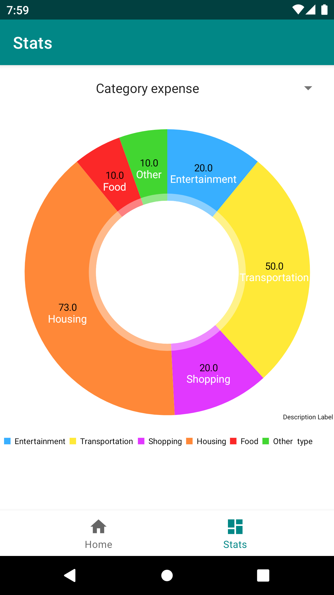

# Money Tracker

The mid-semester project for the subject Mobile Application Development for Android

Author: Patrik JANKUV

Year: 2022/23

Description: The simple money tracking app implemented by Java.

    

## Libraries
- Sugar ORM
- MPAndroidChart
